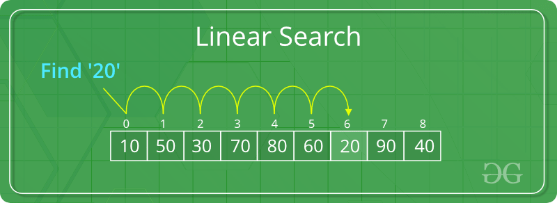
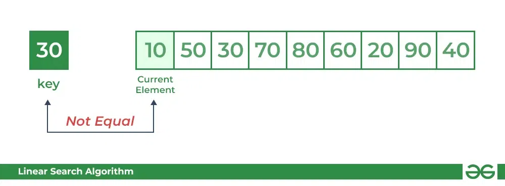
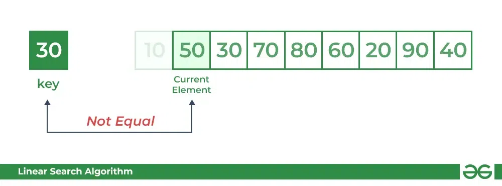
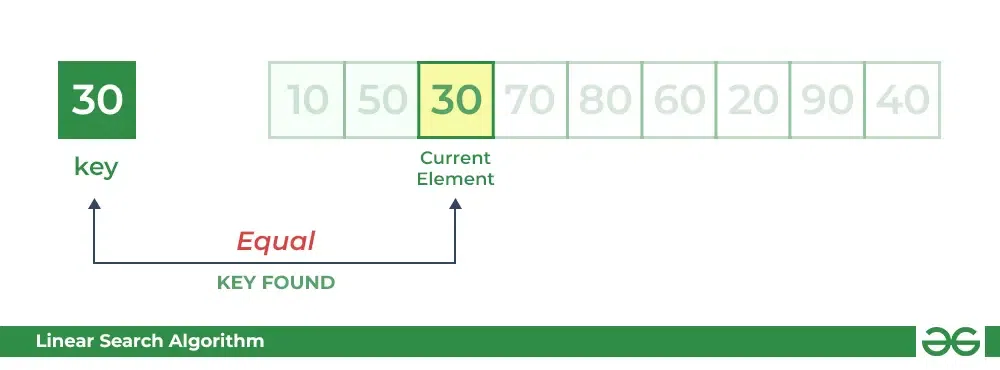

# Linear Search Algorithm

# How Does Linear Search Algorithm Work?

In Linear Search Algorithm, 

Every element is considered as a potential match for the key and checked for the same.
If any element is found equal to the key, the search is successful and the index of that element is returned.
If no element is found equal to the key, the search yields “No match found”.
For example: Consider the array arr[] = {10, 50, 30, 70, 80, 20, 90, 40} and key = 30

- Step 1: Start from the first element (index 0) and compare key with each element (arr[i]).
- Comparing key with first element arr[0]. SInce not equal, the iterator moves to the next element as a potential match.

- Comparing key with next element arr[1]. SInce not equal, the iterator moves to the next element as a potential match.

Step 2: Now when comparing arr[2] with key, the value matches. So the Linear Search Algorithm will yield a successful message and return the index of the element when key is found (here 2).

Compare key with arr[2]

# Complexity Analysis of Linear Search:

Time Complexity:

Best Case: In the best case, the key might be present at the first index. So the best case complexity is O(1)
Worst Case: In the worst case, the key might be present at the last index i.e., opposite to the end from which the search has started in the list. So the worst-case complexity is O(N) where N is the size of the list.
Average Case: O(N)

